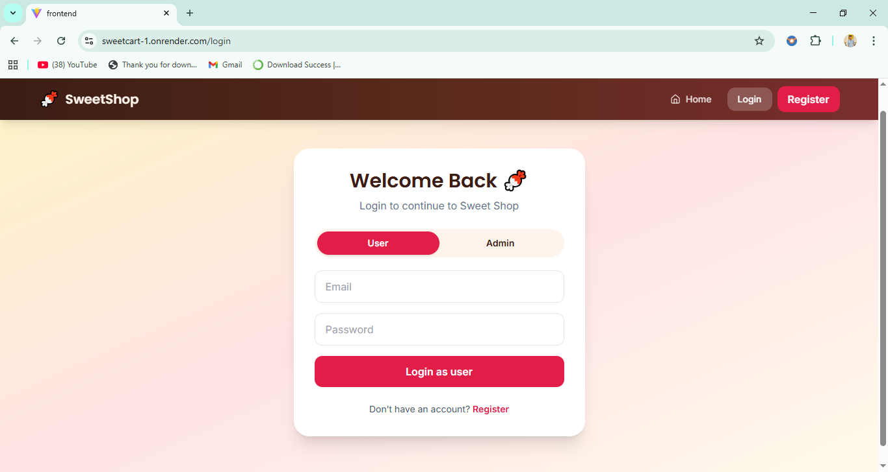
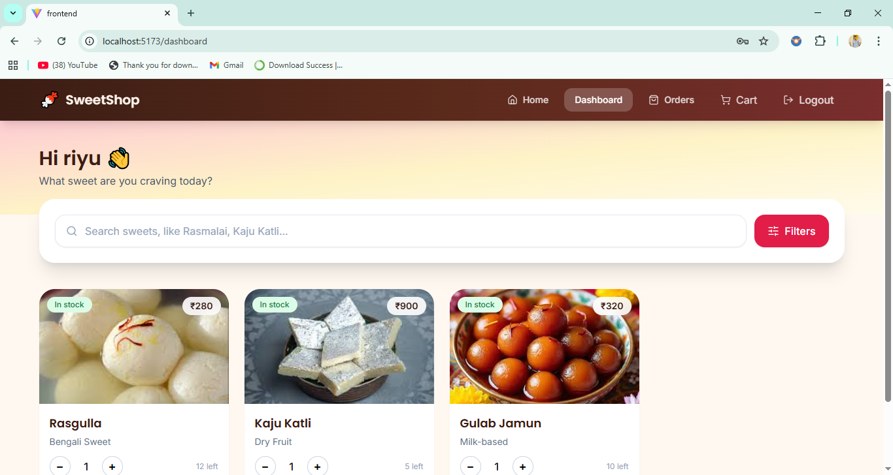
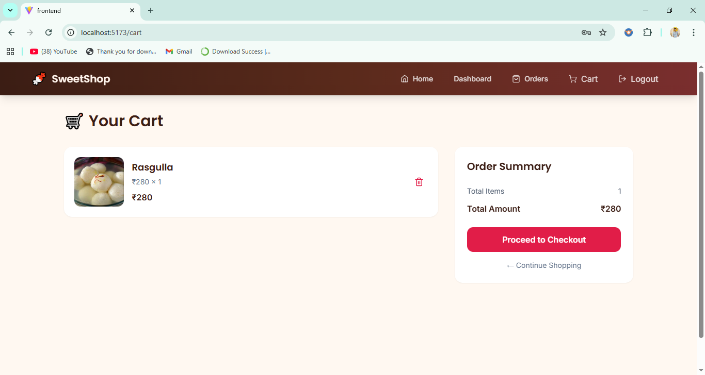
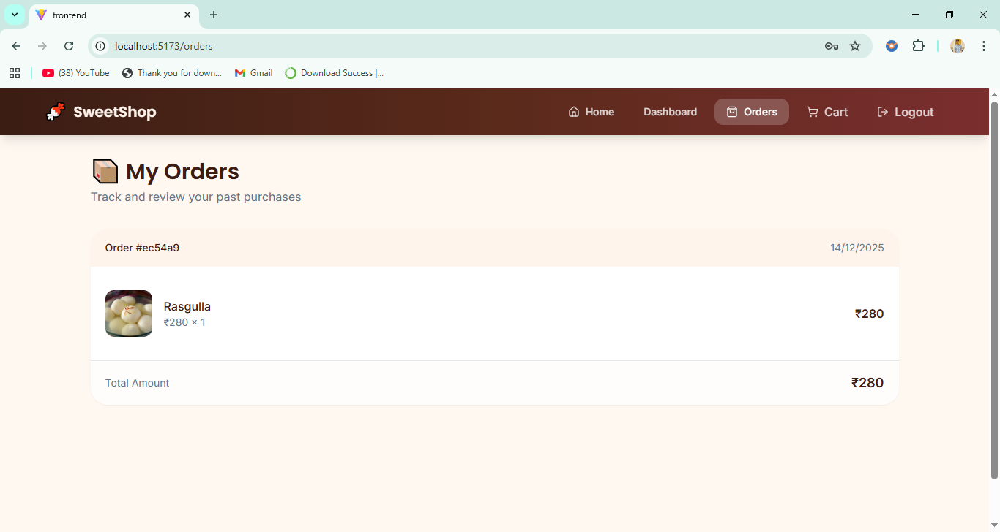
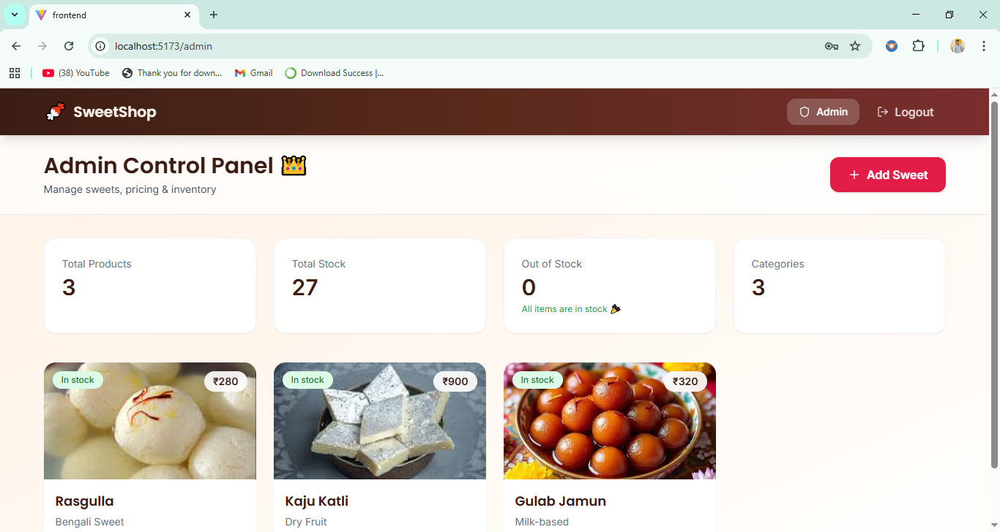

# 🍬 Sweet Shop Management System (MERN Stack)

## 📌 Project Description
Sweet Shop Management System ek full-stack web application hai jo MERN stack par bana hai.  
Is project me **User** aur **Admin** dono roles supported hain.


### 📸 Screenshots










### Key Features
- User registration & login
- Admin dashboard for inventory management
- Online sweet ordering
- Cart & checkout
- Order history
- Role-based access control
- Fully responsive modern UI

---

## 🛠 Tech Stack

### Frontend
- React (Vite)
- Tailwind CSS
- Axios
- React Router DOM
- React Hot Toast
- Framer Motion
- Lucide Icons

### Backend
- Node.js
- Express.js
- MongoDB
- Mongoose

### Authentication
- JWT (JSON Web Token)
- bcrypt

---

## ⚙️ Local Setup Guide

### 1️⃣ Clone Repository
```bash
git clone https://github.com/riyalchandrakar/sweetcart.git
cd sweetcart

```

### 🔧 Backend Setup
```bash
cd backend
npm install
```

### Create .env file inside backend folder
```bash
PORT=5000
MONGO_URI=your_mongodb_connection_string
JWT_SECRET=your_secret_key
```

### Run Backend Server
```bash
npm start
```

### Backend will run on:
```bash
http://localhost:5000
```

## 👑 Admin Seed (Mandatory Step)

### Ye step database me default admin account create karta hai.

### Run seed command
```bash
npm run seed:admin
```
### OR (manual)
```bash
node src/seed/adminSeed.js
```
```bash
Default Admin Credentials
Email    : admin@sweetshop.com
Password : admin123
Role     : admin
```

⚠️ Important Notes:

Ye command sirf ek baar run karein

Password automatically hashed hota hai

Admin same login page se login karega

### 🎨 Frontend Setup
```bash
cd ../frontend
npm install
```

### Create .env file inside frontend folder
```bash
VITE_API_URL=http://localhost:5000/api

Run Frontend
npm run dev
```

### Frontend will run on:
```bash
http://localhost:5173
```

### 🧪 Test Report (Manual Testing)

  -- All major features manually tested:

  -- User registration & login

  -- Admin login & role protection

  -- Cart persistence (localStorage)

  -- Checkout & order placement

  -- Stock update after purchase

  -- User order history

  -- Admin CRUD operations (Add / Edit / Delete sweets)

  -- Out-of-stock handling

  -- Responsive UI (Mobile / Tablet / Desktop)

✅ All test cases passed successfully


### 🤖 My AI Usage

 AI tools (ChatGPT) were used to assist with:

   Debugging runtime and logic errors

   Improving UI/UX using Tailwind CSS

   Refactoring React components

   Understanding MERN architecture patterns

   Writing cleaner and maintainable code

 All suggestions were reviewed, understood, and manually implemented.


### 🚀 Live Deployment

#### 🔗 Live App:
https://sweetcart-1.onrender.com


### 👨‍💻 Author

Riyal Chandrakar<br>
Full Stack Developer (MERN)